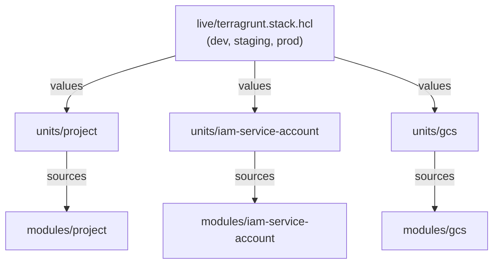

# GCP Foundation Modules

Reusable Terraform modules + Terragrunt compositions for GCP infrastructure.
Follows [cloud-foundation-fabric](https://github.com/GoogleCloudPlatform/cloud-foundation-fabric) design patterns.

## Getting Started

### Prerequisites

Install [mise](https://mise.jdx.dev):

```bash
curl https://mise.jdx.dev/install.sh | sh
```

### Setup

```bash
git clone https://github.com/Chopsticks13/gcp-foundation-modules.git
cd gcp-foundation-modules
mise trust    # trust this repo's mise.toml
mise install  # installs all tools at pinned versions
pre-commit install  # set up git hooks
```

## Architecture

```
modules/    Pure Terraform modules (project, iam-service-account, gcs)
    |
units/      Terragrunt unit definitions (wrap each module, wire inputs)
    |
live/       Actual deployments (terragrunt.stack.hcl declares environments)
```



## Repository Structure

```
gcp-foundation-modules/
├── modules/                  # Layer 1: Pure Terraform modules
│   ├── project/              #   GCP project, APIs, IAM, org policies
│   ├── iam-service-account/  #   Service account, IAM on/for SA
│   └── gcs/                  #   GCS bucket, lifecycle, IAM
├── units/                    # Layer 2: Terragrunt unit definitions
│   ├── project/
│   ├── iam-service-account/
│   └── gcs/
├── live/                     # Layer 3: Actual deployments
│   └── terragrunt.stack.hcl  #   Declares dev (staging/prod added here)
├── root.hcl                  # Remote state + provider generation
├── org.hcl                   # Org-wide config (billing, region)
└── mise.toml                 # Tool version pinning
```

## Modules

| Module | Description |
|--------|-------------|
| [project](modules/project/) | GCP project with API enablement, IAM, org policies, Shared VPC |
| [iam-service-account](modules/iam-service-account/) | Service account with IAM bindings on/for the SA |
| [gcs](modules/gcs/) | GCS bucket with versioning, lifecycle, retention, CMEK |

## Branching Strategy

Trunk-based development. See [docs/BRANCHING.md](docs/BRANCHING.md) for details.

## Releases

Semantic versioning with git tags:

```hcl
terraform {
  source = "git::https://github.com/Chopsticks13/gcp-foundation-modules.git//modules/project?ref=v0.1.0"
}
```

## Tool Versions

All tool versions are pinned in [mise.toml](mise.toml). Run `mise install` to get the exact versions used by CI.
