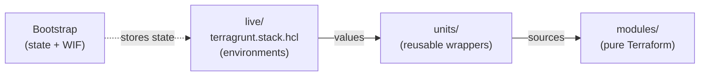

# GCP Foundation Modules

[](https://github.com/Chopsticks13/gcp-foundation-modules/actions/workflows/pr-validation.yml)
[](https://www.checkov.io/)
[](https://www.terraform.io/)
[](https://terragrunt.gruntwork.io/)
[](https://pre-commit.com/)
[](LICENSE)

Reusable Terraform modules + Terragrunt 1.0 stacks for GCP infrastructure.
Inspired by [cloud-foundation-fabric](https://github.com/GoogleCloudPlatform/cloud-foundation-fabric) design patterns.

## Architecture



## Modules

| Module | Description | Docs |
|--------|-------------|------|
| [project](modules/project/) | GCP project, API enablement, IAM, org policies, Shared VPC | [variables](modules/project/variables.tf) |
| [iam-service-account](modules/iam-service-account/) | Service account with IAM on/for the SA | [variables](modules/iam-service-account/variables.tf) |
| [gcs](modules/gcs/) | GCS bucket with versioning, lifecycle, retention, CMEK | [variables](modules/gcs/variables.tf) |
| [wif-github](modules/wif-github/) | Workload Identity Federation for GitHub Actions | [variables](modules/wif-github/variables.tf) |

## Getting Started

### Prerequisites

Install [mise](https://mise.jdx.dev):

```bash
curl https://mise.jdx.dev/install.sh | sh
```

### Setup

```bash
git clone https://github.com/Chopsticks13/gcp-foundation-modules.git
cd gcp-foundation-modules
mise trust && mise install
pre-commit install
```

### Deploy

```bash
cd live
terragrunt stack generate        # generate units from stack definition
terragrunt stack run -- plan     # plan all units
terragrunt stack run -- apply    # apply all units
```

### Useful Commands

```bash
terragrunt list                  # list all units
terragrunt dag graph             # show dependency graph (pipe to dot for PNG)
terragrunt stack output          # show outputs from all units
terragrunt stack clean           # remove generated files
```

## Repository Structure

```
gcp-foundation-modules/
├── modules/                  # Layer 1: Pure Terraform modules
│   ├── project/
│   ├── iam-service-account/
│   ├── gcs/
│   └── wif-github/
├── units/                    # Layer 2: Terragrunt unit definitions
│   ├── project/
│   ├── iam-service-account/
│   ├── gcs/
│   └── wif-github/
├── live/                     # Layer 3: Actual deployments
│   └── terragrunt.stack.hcl
├── docs/                     # Documentation
│   ├── BRANCHING.md          # Trunk-based development strategy
│   ├── CI.md                 # CI/CD pipeline explained
│   ├── NAMING.md             # Resource naming conventions
│   └── WIF.md                # Workload Identity Federation setup
├── root.hcl                  # Remote state + provider generation
├── org.hcl                   # Org-wide config (billing, region)
└── mise.toml                 # Tool version pinning
```

## Documentation

| Doc | What it covers |
|-----|---------------|
| [Bootstrap](docs/BOOTSTRAP.md) | Chicken-and-egg problem, project structure, no-org decision |
| [Branching](docs/BRANCHING.md) | Trunk-based dev, branch naming, deployment flow |
| [Terragrunt](docs/TERRAGRUNT.md) | Why Terragrunt, how stacks work, the three-layer architecture |
| [CI Pipeline](docs/CI.md) | What each validation step does (tflint, checkov, etc.) |
| [Naming](docs/NAMING.md) | Resource naming conventions with Google/Azure references |
| [WIF](docs/WIF.md) | Workload Identity Federation setup and bootstrap |

## Tool Versions

All versions pinned in [mise.toml](mise.toml). Run `mise install` to match CI exactly.

## License

[MIT](LICENSE)
