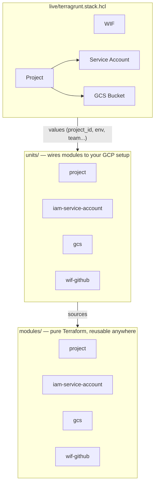
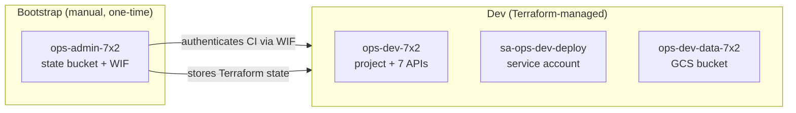
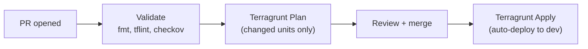

# GCP Foundation Modules

[](https://github.com/Chopsticks13/gcp-foundation-modules/actions/workflows/pr-validation.yml)
[](https://www.checkov.io/)
[](https://www.terraform.io/)
[](https://terragrunt.gruntwork.io/)
[](https://pre-commit.com/)
[](LICENSE)

Reusable Terraform modules + Terragrunt 1.0 stacks for GCP infrastructure.
Inspired by [cloud-foundation-fabric](https://github.com/GoogleCloudPlatform/cloud-foundation-fabric) design patterns.

## How It Works



> **One file, one command, full environment.** Add staging or prod by adding a block with different values — same modules, same units, different inputs.

## What Gets Deployed



## CI/CD Pipeline



Every PR runs validation and security scans. Plan only runs against units affected by the change. See [docs/CI.md](docs/CI.md) for details.

## Modules

| Module | Description | Docs |
|--------|-------------|------|
| [project](modules/project/) | GCP project, API enablement, IAM, org policies, Shared VPC | [variables](modules/project/variables.tf) |
| [iam-service-account](modules/iam-service-account/) | Service account with IAM on/for the SA | [variables](modules/iam-service-account/variables.tf) |
| [gcs](modules/gcs/) | GCS bucket with versioning, lifecycle, retention, CMEK | [variables](modules/gcs/variables.tf) |
| [wif-github](modules/wif-github/) | Workload Identity Federation for GitHub Actions | [variables](modules/wif-github/variables.tf) |

## Getting Started

### Prerequisites

Install [mise](https://mise.jdx.dev) (manages all tool versions from one file):

```bash
curl https://mise.jdx.dev/install.sh | sh
```

### Setup

```bash
git clone https://github.com/Chopsticks13/gcp-foundation-modules.git
cd gcp-foundation-modules
mise trust && mise install    # installs terraform, terragrunt, tflint, etc.
pre-commit install            # sets up git hooks
```

### Deploy

```bash
cd live
terragrunt stack generate        # generate units from stack definition
terragrunt stack run -- plan     # plan all units
terragrunt stack run -- apply    # apply all units
```

### Useful Commands

```bash
terragrunt list                  # list all units in the stack
terragrunt dag graph             # dependency graph (pipe to dot for PNG)
terragrunt stack output          # outputs from all deployed units
terragrunt stack clean           # remove generated files
```

## Repository Structure

```
gcp-foundation-modules/
├── modules/                  # Layer 1: Pure Terraform modules
│   ├── project/              #   GCP project, APIs, IAM, org policies
│   ├── iam-service-account/  #   Service account with IAM on/for SA
│   ├── gcs/                  #   GCS bucket with lifecycle, IAM
│   └── wif-github/           #   WIF pool, OIDC provider, deploy SA
├── units/                    # Layer 2: Terragrunt wrappers
│   ├── project/              #   Wires project module to our GCP setup
│   ├── iam-service-account/
│   ├── gcs/
│   └── wif-github/
├── live/                     # Layer 3: What actually gets deployed
│   └── terragrunt.stack.hcl  #   Declares environments + values
├── docs/                     # Decision docs with diagrams
├── root.hcl                  # Remote state (GCS) + provider config
├── org.hcl                   # Billing, region, CI/CD SA
└── mise.toml                 # Tool version pinning
```

## Documentation

| Doc | What it covers |
|-----|---------------|
| [Bootstrap](docs/BOOTSTRAP.md) | Chicken-and-egg problem, project structure, no-org decision |
| [Branching](docs/BRANCHING.md) | Trunk-based dev, branch naming, deployment flow |
| [Terragrunt](docs/TERRAGRUNT.md) | Why Terragrunt over pure Terraform, how stacks work |
| [CI Pipeline](docs/CI.md) | What each validation step does (tflint, checkov, etc.) |
| [Naming](docs/NAMING.md) | Resource naming conventions with Google/Azure references |
| [WIF](docs/WIF.md) | Workload Identity Federation — no keys, OIDC auth |

## Tool Versions

All versions pinned in [mise.toml](mise.toml). Run `mise install` to match CI exactly.

## License

[MIT](LICENSE)
