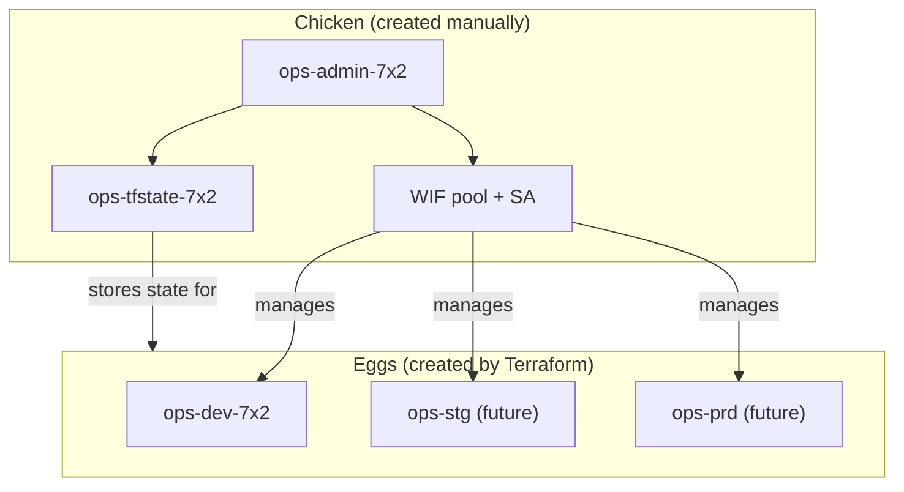

# Bootstrap & Project Structure

## The Chicken and the Egg

Terraform needs a GCS bucket to store state. But Terraform creates buckets.
So what creates the first one?

**You do, manually. Once.** This is the "bootstrap" or "chicken" project.



## How It Was Created

The bootstrap project was created manually via `gcloud`:

```bash
gcloud projects create ops-admin-7x2 --name="Ops Admin"
gcloud billing projects link ops-admin-7x2 --billing-account=018634-AC68FD-0FE666
gcloud services enable cloudresourcemanager.googleapis.com storage.googleapis.com \
  iam.googleapis.com serviceusage.googleapis.com --project=ops-admin-7x2
gcloud storage buckets create gs://ops-tfstate-7x2 --project=ops-admin-7x2 \
  --location=europe-west2 --uniform-bucket-level-access
gcloud storage buckets update gs://ops-tfstate-7x2 --versioning
```

After this, everything else is managed by Terraform — including the WIF
resources inside the bootstrap project itself.

## No GCP Organisation (and why that's OK)

This setup runs on a personal Google account, not a GCP Organisation. Here's
what that means:

| Capability | With Org | Without Org (us) |
|-----------|----------|-------------------|
| SA creates new projects | Yes (`roles/resourcemanager.projectCreator`) | No — user creates projects, SA manages them |
| Org-wide policies | Yes (`roles/orgpolicy.policyAdmin`) | No — policies set per-project if needed |
| Folder hierarchy | Yes (dev/staging/prod folders) | No — flat project list |
| Centralized IAM | Yes (org-level bindings) | No — per-project bindings |
| State management | SA via WIF | SA via WIF (same) |
| Module patterns | Identical | Identical |

**The module code and stack structure are the same either way.** If you later
add an Organisation (via [Google Workspace](https://workspace.google.com/) or
[Cloud Identity](https://cloud.google.com/identity)), the only changes are:

1. Add `roles/resourcemanager.projectCreator` and `roles/orgpolicy.policyAdmin`
   back to the WIF SA (they were removed because they need an org to bind to)
2. Set `organization_id` in `org.hcl`
3. Optionally add a `modules/folder` for hierarchy

Everything else — modules, units, stacks, CI/CD, WIF — stays untouched.

## Project Inventory

| Project | Purpose | Managed by |
|---------|---------|-----------|
| `ops-admin-7x2` | Bootstrap: state bucket, WIF, deploy SA | gcloud (initial) + Terraform (WIF) |
| `ops-dev-7x2` | Dev environment resources | Terraform via stacks |
| `ops-stg` | Staging (future) | Terraform via stacks |
| `ops-prd` | Production (future) | Terraform via stacks |

## References

- [GCP: Resource hierarchy](https://cloud.google.com/resource-manager/docs/cloud-platform-resource-hierarchy)
- [GCP: Creating and managing organisations](https://cloud.google.com/resource-manager/docs/creating-managing-organization)
- [Fabric FAST: bootstrap stage](https://github.com/GoogleCloudPlatform/cloud-foundation-fabric/tree/master/fast/stages/0-org-setup)
