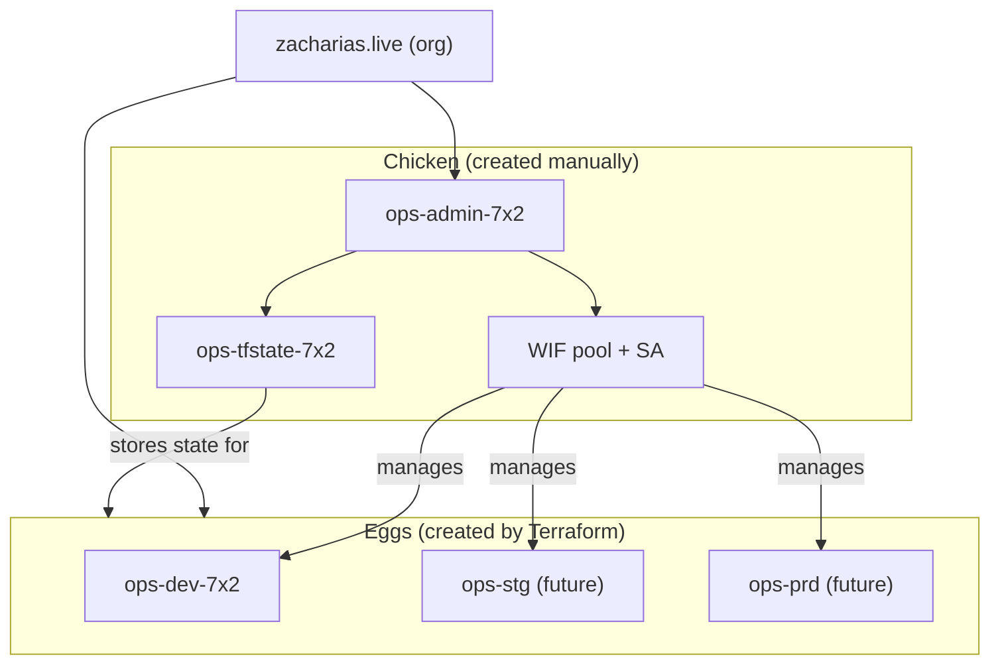

# Bootstrap & Project Structure

## The Chicken and the Egg

Terraform needs a GCS bucket to store state. But Terraform creates buckets.
So what creates the first one?

**You do, manually. Once.** This is the "bootstrap" or "chicken" project.



## How It Was Created

The bootstrap project was created manually via `gcloud`:

```bash
gcloud projects create ops-admin-7x2 --name="Ops Admin"
gcloud billing projects link ops-admin-7x2 --billing-account=018634-AC68FD-0FE666
gcloud services enable cloudresourcemanager.googleapis.com storage.googleapis.com \
  iam.googleapis.com serviceusage.googleapis.com --project=ops-admin-7x2
gcloud storage buckets create gs://ops-tfstate-7x2 --project=ops-admin-7x2 \
  --location=europe-west2 --uniform-bucket-level-access
gcloud storage buckets update gs://ops-tfstate-7x2 --versioning
```

After this, everything else is managed by Terraform — including the WIF
resources inside the bootstrap project itself.

## GCP Organisation

This setup uses a GCP Organisation (`zacharias.live`, ID `161389005902`)
provisioned via [Cloud Identity Free](https://cloud.google.com/identity).
All projects sit directly under the organisation.

| Capability | Status |
|-----------|--------|
| SA creates new projects | Available (`roles/resourcemanager.projectCreator` on org) |
| Org-wide policies | Available (`roles/orgpolicy.policyAdmin` on org) |
| Folder hierarchy | Not yet used — flat project list under org |
| Centralized IAM | Per-project bindings (can move to org-level later) |
| State management | SA via WIF |

### Future improvements

1. Add `roles/resourcemanager.projectCreator` to the WIF SA at org level so
   CI/CD can create new projects automatically
2. Add a `modules/folder` for dev/staging/prod hierarchy
3. Move to org-level IAM bindings where appropriate

## Project Inventory

| Project | Purpose | Managed by |
|---------|---------|-----------|
| `ops-admin-7x2` | Bootstrap: state bucket, WIF, deploy SA | gcloud (initial) + Terraform (WIF) |
| `ops-dev-7x2` | Dev environment resources | Terraform via stacks |
| `ops-stg` | Staging (future) | Terraform via stacks |
| `ops-prd` | Production (future) | Terraform via stacks |

## References

- [GCP: Resource hierarchy](https://cloud.google.com/resource-manager/docs/cloud-platform-resource-hierarchy)
- [GCP: Creating and managing organisations](https://cloud.google.com/resource-manager/docs/creating-managing-organization)
- [Fabric FAST: bootstrap stage](https://github.com/GoogleCloudPlatform/cloud-foundation-fabric/tree/master/fast/stages/0-org-setup)
