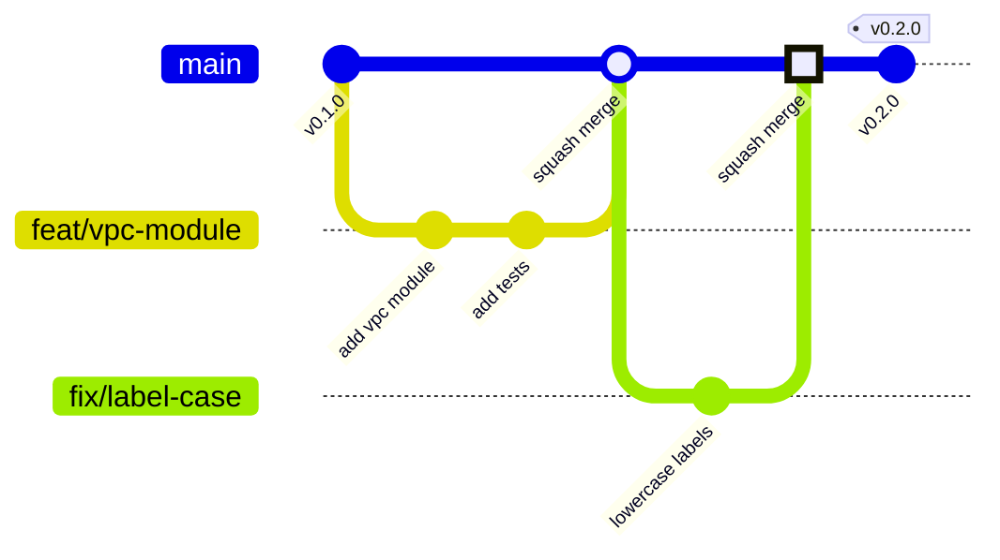
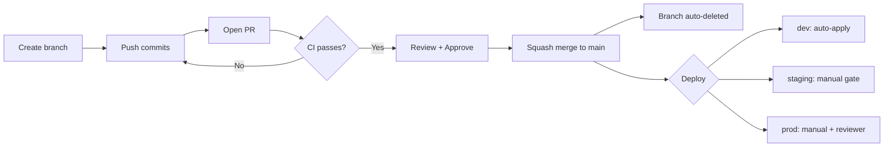
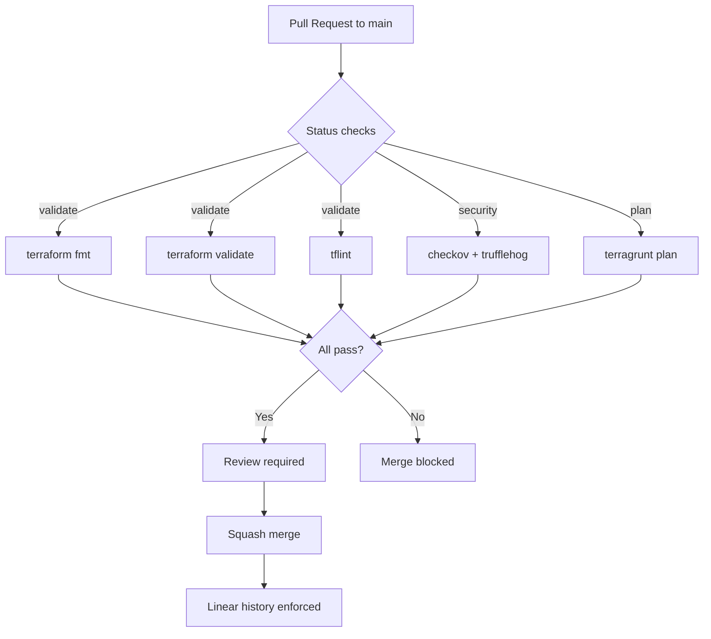

# Branching & Deployment Strategy

## Trunk-Based Development

`main` is the single source of truth. All changes go through short-lived branches.



## Branch Naming

```
{type}/{description}
```

| Prefix | Use | Example |
|--------|-----|---------|
| `feat/` | New module, resource, capability | `feat/add-vpc-module` |
| `fix/` | Bug fix, config correction | `fix/project-labels-lowercase` |
| `chore/` | Maintenance, dependencies, tooling | `chore/upgrade-tg-1.0` |
| `docs/` | Documentation only | `docs/readme-overhaul` |
| `refactor/` | Restructuring, no behaviour change | `refactor/extract-sa-module` |

## How a Change Flows



## Branch Protection on main



## Rules

1. **main** is always deployable
2. Branches live max 1-2 days
3. Squash merge only (linear history)
4. Environments are Terragrunt stacks, not git branches
5. No force pushes to main

## Releases

Tag main with semver, GitHub Actions creates the release automatically.

```bash
git tag -a v0.1.0 -m "Day 1 module kit"
git push origin v0.1.0
```

Consumers pin to tags:

```hcl
terraform {
  source = "git::https://github.com/Chopsticks13/gcp-foundation-modules.git//modules/project?ref=v0.1.0"
}
```
