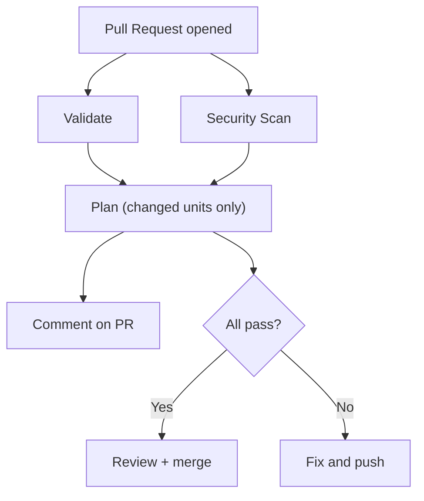

# CI/CD Pipeline

Our CI pipeline runs on every pull request to `main`. It validates code quality,
scans for security issues, and plans only the infrastructure that changed.

References:
- [Terragrunt: Git-based filters](https://docs.terragrunt.com/features/filter/git)
- [Terragrunt: Stack operations](https://docs.terragrunt.com/features/stacks/stack-operations/)
- [TFLint](https://github.com/terraform-linters/tflint)
- [Checkov](https://www.checkov.io/)
- [TruffleHog](https://github.com/trufflesecurity/trufflehog)

## Pipeline Overview



Validation and security run **in parallel**. Plan runs after both pass —
no point planning broken code against GCP.

## Planning Strategy

CI runs `terragrunt stack run -- plan` which plans all units in the stack.
At our current size (4 units, ~20 seconds) this is fast enough.

### Future: --filter-affected

Terragrunt 1.0 supports [git-based filters](https://docs.terragrunt.com/features/filter/git)
that only plan units affected by a PR's changes:

```bash
terragrunt run --all --filter '[main...HEAD]' -- plan
```

This works well for repos with **standalone units** (no stack). For our
**stack-based** setup, the filter discovers the unit templates in `units/`
and tries to run them directly — but they need `values` from the stack
to work. When Terragrunt adds filter support to `stack run`, we'll switch.

Reference: [Terragrunt: Git filter docs](https://docs.terragrunt.com/features/filter/git)

## What Each Check Does

### Terraform Format (`terraform fmt -check`)

Checks that all `.tf` files follow standard Terraform formatting.

**Fix locally:** `terraform fmt -recursive`

### Terraform Validate (`terraform validate`)

Runs in each module directory. Checks HCL syntax, variable definitions,
resource arguments, and type constraints. Does not connect to any cloud provider.

**Fix locally:** `cd modules/<name> && terraform init -backend=false && terraform validate`

### TFLint

[TFLint](https://github.com/terraform-linters/tflint) is a pluggable linter
for Terraform. Goes beyond `validate` to catch things that are syntactically
valid but wrong:

| What it catches | Example |
|----------------|---------|
| Unused variables/outputs | Declared `variable "foo"` but never referenced |
| Unused providers | `google-beta` in `required_providers` but no beta resources |
| Naming conventions | Variables not in `snake_case` |
| Missing descriptions | Variables or outputs without `description` |
| Deprecated syntax | Using `${var.x}` where `var.x` suffices |
| Google-specific rules | Invalid machine types, wrong region formats |

We use two plugins:
- [**terraform**](https://github.com/terraform-linters/tflint-ruleset-terraform) — general Terraform best practices
- [**google**](https://github.com/terraform-linters/tflint-ruleset-google) — GCP-specific rules (validates resource arguments against the real API)

Config: [.tflint.hcl](../.tflint.hcl)

### Checkov

[Checkov](https://www.checkov.io/) is a static analysis security scanner by
Bridgecrew/Palo Alto. Scans Terraform modules for misconfigurations:

| What it catches | Example |
|----------------|---------|
| Public buckets | `uniform_bucket_level_access = false` |
| Overly permissive IAM | `roles/owner` on a service account |
| Missing encryption | No CMEK configured on storage |
| Missing logging | Audit logs not enabled |

Runs with `--soft-fail` so it reports findings without blocking the pipeline.

### TruffleHog

[TruffleHog](https://github.com/trufflesecurity/trufflehog) scans the Git diff
for accidentally committed secrets — API keys, tokens, passwords, private keys.
Compares the PR branch against `main` so it only checks new changes.

### Terragrunt Plan

Runs `terragrunt run --all --filter-affected -- plan` to plan only the units
affected by the PR. The plan output is posted as a comment on the PR for review.

**Requires:** Workload Identity Federation (WIF) to authenticate to GCP. See
[WIF.md](WIF.md) for setup.

## Where the Config Lives

| File | Purpose |
|------|---------|
| [.github/workflows/pr-validation.yml](../.github/workflows/pr-validation.yml) | The pipeline definition |
| [.tflint.hcl](../.tflint.hcl) | TFLint rules and plugin config |
| [.yamllint.yaml](../.yamllint.yaml) | YAML lint rules |
| [.pre-commit-config.yaml](../.pre-commit-config.yaml) | Local pre-commit hooks (same checks, run before push) |
| [mise.toml](../mise.toml) | Tool versions used by CI and locally |
