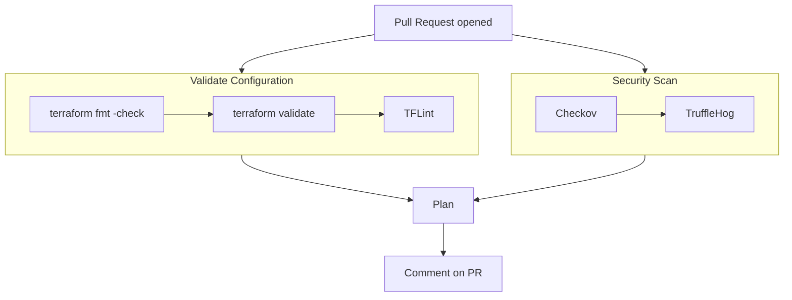

# CI/CD Pipeline

Our CI pipeline runs on every pull request to `main`. It validates code quality,
scans for security issues, and plans infrastructure changes — all before anything
gets merged.

## Pipeline Overview

## What Each Check Does

### Terraform Format (`terraform fmt -check`)

Checks that all `.tf` files follow the standard Terraform formatting rules —
consistent indentation, alignment, spacing. Fails if any file needs reformatting.

**Fix locally:** `terraform fmt -recursive`

### Terraform Validate (`terraform validate`)

Runs in each module directory. Checks that the HCL syntax is valid, required
variables are defined, resource arguments exist in the provider schema, and
type constraints are satisfied. Does not connect to any cloud provider.

**Fix locally:** `cd modules/<name> && terraform init -backend=false && terraform validate`

### TFLint

[TFLint](https://github.com/terraform-linters/tflint) is a pluggable linter
for Terraform. Goes beyond `validate` to catch things that are syntactically
valid but wrong:

| What it catches | Example |
|----------------|---------|
| Unused variables/outputs | Declared `variable "foo"` but never referenced |
| Unused providers | `google-beta` in `required_providers` but no beta resources |
| Naming conventions | Variables not in `snake_case` |
| Missing descriptions | Variables or outputs without `description` |
| Deprecated syntax | Using `${var.x}` where `var.x` suffices |
| Google-specific rules | Invalid machine types, wrong region formats |

We use two plugins:
- [**terraform**](https://github.com/terraform-linters/tflint-ruleset-terraform) — general Terraform best practices
- [**google**](https://github.com/terraform-linters/tflint-ruleset-google) — GCP-specific rules (validates resource arguments against the real API)

Config: [.tflint.hcl](../.tflint.hcl)

### Checkov

[Checkov](https://www.checkov.io/) is a static analysis security scanner by
Bridgecrew/Palo Alto. Scans Terraform modules for misconfigurations:

| What it catches | Example |
|----------------|---------|
| Public buckets | `uniform_bucket_level_access = false` |
| Overly permissive IAM | `roles/owner` on a service account |
| Missing encryption | No CMEK configured on storage |
| Missing logging | Audit logs not enabled |
| Deletion protection off | `deletion_policy = "DELETE"` without justification |

Runs with `--soft-fail` so it reports findings without blocking the pipeline.
This lets us see issues without being blocked by checks that don't apply to
our context.

### TruffleHog

[TruffleHog](https://github.com/trufflesecurity/trufflehog) scans the Git diff
for accidentally committed secrets — API keys, tokens, passwords, private keys.
Compares the PR branch against `main` so it only checks new changes.

### Terragrunt Stack Plan

Runs `terragrunt stack run -- plan` against the live stack. Shows exactly what
infrastructure changes the PR would cause. The plan output is posted as a
comment on the PR for review.

**Requires:** Workload Identity Federation (WIF) to authenticate to GCP. See
[WIF.md](WIF.md) for setup.

## Where the Config Lives

| File | Purpose |
|------|---------|
| [.github/workflows/pr-validation.yml](../.github/workflows/pr-validation.yml) | The pipeline definition |
| [.tflint.hcl](../.tflint.hcl) | TFLint rules and plugin config |
| [.yamllint.yaml](../.yamllint.yaml) | YAML lint rules |
| [.pre-commit-config.yaml](../.pre-commit-config.yaml) | Local pre-commit hooks (same checks, run before push) |
| [mise.toml](../mise.toml) | Tool versions used by CI and locally |
