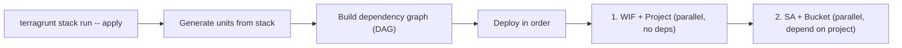

# Why Terragrunt (and not just Terraform)

## What is Terraform?

[Terraform](https://www.terraform.io/) is an infrastructure-as-code tool. You
write `.tf` files describing what cloud resources you want, and Terraform
creates them. Our modules (`modules/project`, `modules/gcs`, etc.) are pure
Terraform.

## What is Terragrunt?

[Terragrunt](https://terragrunt.gruntwork.io/) is a thin wrapper around
Terraform that solves the problems you hit when managing multiple environments
and modules together. It was created by [Gruntwork](https://gruntwork.io/),
one of the most respected infrastructure consultancies.

## Why not pure Terraform?

With pure Terraform you'd have one of two bad options:

**Option A: One giant Terraform root module**

```
# Everything in one state file
resource "google_project" "dev" { ... }
resource "google_project" "staging" { ... }
resource "google_project" "prod" { ... }
resource "google_storage_bucket" "dev" { ... }
resource "google_storage_bucket" "staging" { ... }
# ... hundreds of resources, one blast radius
```

Problem: changing a dev bucket requires Terraform to evaluate your entire
prod infrastructure too. One state file = one blast radius.

**Option B: Copy-paste module calls per environment**

```
environments/
├── dev/
│   ├── main.tf      # module "project" { source = "../../modules/project" }
│   ├── backend.tf   # backend "gcs" { bucket = "..." prefix = "dev" }
│   └── variables.tf
├── staging/
│   ├── main.tf      # same thing, copy-pasted
│   ├── backend.tf   # same thing, different prefix
│   └── variables.tf
└── prod/
    ├── main.tf      # same thing again
    ├── backend.tf
    └── variables.tf
```

Problem: massive duplication. Backend config, provider config, and module
wiring are copy-pasted everywhere. Adding a new module means editing every
environment. Drift between environments is inevitable.

**What Terragrunt gives you: DRY configuration**

```
root.hcl          # backend + provider config (written once)
org.hcl           # shared values (written once)
live/
└── terragrunt.stack.hcl   # all environments declared in one place
```

No duplication. Backend config is generated. Provider config is generated.
Adding a new environment is adding a block to the stack file.

## Terragrunt 1.0 Stacks

[Terragrunt 1.0](https://www.gruntwork.io/blog/terragrunt-1-0-released)
(released March 2026) introduced **Stacks** — a way to define, deploy, and
manage groups of Terraform modules as a single unit.

### The Three Layers

```mermaid
flowchart TD
  subgraph L1["Layer 1: Modules"]
    direction LR
    m1["modules/project<br/>(pure Terraform)"]
    m2["modules/iam-service-account"]
    m3["modules/gcs"]
    m4["modules/wif-github"]
  end

  subgraph L2["Layer 2: Units"]
    direction LR
    u1["units/project<br/>(wraps module, wires inputs)"]
    u2["units/iam-service-account"]
    u3["units/gcs"]
    u4["units/wif-github"]
  end

  subgraph L3["Layer 3: Live"]
    live["live/terragrunt.stack.hcl<br/>(declares what gets deployed)"]
  end

  L3 -->|"values flow down"| L2
  L2 -->|"sources"| L1

  style L1 fill:#1a1a2e
  style L2 fill:#16213e
  style L3 fill:#0f3460
```



**Modules** — pure Terraform. No Terragrunt, no opinions on how they're called.
Reusable by anyone, even without Terragrunt.

**Units** — Terragrunt wrappers. Each unit sources a module, includes shared
config (`root.hcl` for backend/provider, `org.hcl` for org values), declares
dependencies on other units, and reads values passed from the stack.

**Live** — the `terragrunt.stack.hcl` file that declares what actually exists.
Each `unit` block says "deploy this unit at this path with these values."

### How a Deploy Works



Terragrunt reads the stack file, generates the unit configs into
`.terragrunt-stack/`, builds a DAG from the `dependency` blocks, then
runs `terraform apply` on each unit in the correct order.

### Key Commands

| Command | What it does |
|---------|-------------|
| `terragrunt stack generate` | Generate unit configs from stack definition |
| `terragrunt stack run -- plan` | Plan all units in dependency order |
| `terragrunt stack run -- apply` | Apply all units in dependency order |
| `terragrunt stack output` | Show outputs from all units |
| `terragrunt stack clean` | Remove generated `.terragrunt-stack/` |
| `terragrunt list` | List all units |
| `terragrunt dag graph` | Show dependency graph (DOT format) |

### What Terragrunt Generates

When you run `terragrunt stack generate`, it creates:

```
live/.terragrunt-stack/
├── bootstrap/
│   └── wif-github/
│       ├── terragrunt.hcl         # copied from units/wif-github/
│       └── terragrunt.values.hcl  # values passed from stack
├── dev/
│   ├── project/
│   │   ├── terragrunt.hcl
│   │   └── terragrunt.values.hcl
│   ├── iam-service-account/
│   │   ├── terragrunt.hcl
│   │   └── terragrunt.values.hcl
│   └── gcs/
│       ├── terragrunt.hcl
│       └── terragrunt.values.hcl
```

This directory is gitignored — it's generated on demand, not committed.

## References

- [Terraform documentation](https://developer.hashicorp.com/terraform/docs)
- [Terragrunt documentation](https://docs.terragrunt.com/)
- [Terragrunt 1.0 release announcement](https://www.gruntwork.io/blog/terragrunt-1-0-released)
- [Terragrunt Stacks: Explicit stacks](https://docs.terragrunt.com/features/stacks/explicit/)
- [Terragrunt Stack operations](https://docs.terragrunt.com/features/stacks/stack-operations/)
- [Gruntwork: Terragrunt vs pure Terraform](https://docs.terragrunt.com/getting-started/overview/)
