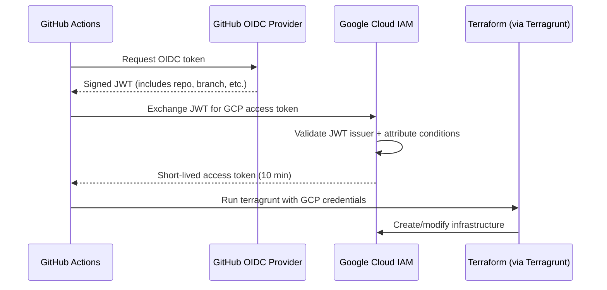

# Workload Identity Federation (WIF)

WIF lets GitHub Actions authenticate to GCP without service account keys.
GitHub proves its identity via OIDC, GCP trusts it. No secrets to rotate,
no keys to leak.

## How It Works



## What Gets Created

All WIF resources live in the bootstrap project (`ops-admin-7x2`):

| Resource | Name | Purpose |
|----------|------|---------|
| Workload Identity Pool | `github` | Container for external identities |
| OIDC Provider | `gcp-foundation` | Trusts GitHub's OIDC issuer |
| Service Account | `sa-ops-github-deploy` | The identity Terraform runs as |

## Setup

Run these commands once. Replace `Chopsticks13` with your GitHub username/org
if it ever changes.

```bash
# Variables
export PROJECT_ID="ops-admin-7x2"
export GITHUB_ORG="Chopsticks13"
export REPO="gcp-foundation-modules"

# 1. Enable required API
gcloud services enable iamcredentials.googleapis.com --project=$PROJECT_ID

# 2. Create Workload Identity Pool
gcloud iam workload-identity-pools create "github" \
  --project=$PROJECT_ID \
  --location="global" \
  --display-name="GitHub Actions Pool"

# 3. Create OIDC Provider (with attribute condition restricting to your org)
gcloud iam workload-identity-pools providers create-oidc "gcp-foundation" \
  --project=$PROJECT_ID \
  --location="global" \
  --workload-identity-pool="github" \
  --display-name="GCP Foundation Modules" \
  --attribute-mapping="google.subject=assertion.sub,attribute.repository=assertion.repository,attribute.repository_owner=assertion.repository_owner" \
  --attribute-condition="assertion.repository_owner == '${GITHUB_ORG}'" \
  --issuer-uri="https://token.actions.githubusercontent.com"

# 4. Create a service account for GitHub Actions
gcloud iam service-accounts create "sa-ops-github-deploy" \
  --project=$PROJECT_ID \
  --display-name="GitHub Actions Deploy SA"

# 5. Grant the SA permissions it needs
#    - Editor on the admin project (to manage state bucket, create projects)
#    - Project Creator (to create new GCP projects)
#    - Billing User (to link billing to new projects)
gcloud projects add-iam-policy-binding $PROJECT_ID \
  --member="serviceAccount:sa-ops-github-deploy@${PROJECT_ID}.iam.gserviceaccount.com" \
  --role="roles/editor"

gcloud projects add-iam-policy-binding $PROJECT_ID \
  --member="serviceAccount:sa-ops-github-deploy@${PROJECT_ID}.iam.gserviceaccount.com" \
  --role="roles/resourcemanager.projectCreator"

# 6. Get the pool ID
export POOL_ID=$(gcloud iam workload-identity-pools describe "github" \
  --project=$PROJECT_ID \
  --location="global" \
  --format="value(name)")

# 7. Allow GitHub to impersonate the SA (restricted to your repo)
gcloud iam service-accounts add-iam-policy-binding \
  "sa-ops-github-deploy@${PROJECT_ID}.iam.gserviceaccount.com" \
  --project=$PROJECT_ID \
  --role="roles/iam.workloadIdentityUser" \
  --member="principalSet://iam.googleapis.com/${POOL_ID}/attribute.repository/${GITHUB_ORG}/${REPO}"

# 8. Get the provider resource name (you'll need this for GitHub)
gcloud iam workload-identity-pools providers describe "gcp-foundation" \
  --project=$PROJECT_ID \
  --location="global" \
  --workload-identity-pool="github" \
  --format="value(name)"
```

## Configure GitHub Secrets

Take the output from step 8 and add two secrets to your GitHub repo:

**Settings → Secrets and variables → Actions → New repository secret**

| Secret name | Value |
|-------------|-------|
| `GCP_WORKLOAD_IDENTITY_PROVIDER` | The full provider path from step 8 (looks like `projects/123456789/locations/global/workloadIdentityPools/github/providers/gcp-foundation`) |
| `GCP_SERVICE_ACCOUNT` | `sa-ops-github-deploy@ops-admin-7x2.iam.gserviceaccount.com` |

## Security

- **No keys** — WIF uses short-lived tokens (10 min), no long-lived credentials
- **Attribute conditions** — only repos owned by `Chopsticks13` can authenticate
- **Least privilege** — the SA only has the permissions it needs
- **Audit trail** — all authentication events show up in Cloud Audit Logs
