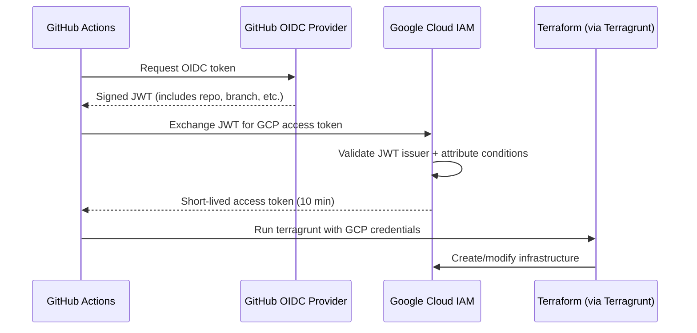

# Workload Identity Federation (WIF)

WIF lets GitHub Actions authenticate to GCP without service account keys.
GitHub proves its identity via OIDC, GCP trusts it. No secrets to rotate,
no keys to leak.

References:
- [Google: WIF with deployment pipelines](https://cloud.google.com/iam/docs/workload-identity-federation-with-deployment-pipelines)
- [google-github-actions/auth](https://github.com/google-github-actions/auth)
- [GitHub: OIDC with cloud providers](https://docs.github.com/en/actions/security-for-github-actions/security-hardening-your-deployments/configuring-openid-connect-in-cloud-providers)

## How It Works



## Managed by Terraform

WIF is not a manual setup — it's managed as code via `modules/wif-github`
and deployed through the stack like everything else. This follows the
[cloud-foundation-fabric](https://github.com/GoogleCloudPlatform/cloud-foundation-fabric)
pattern where WIF lives in the IaC admin project.

The WIF unit in `live/terragrunt.stack.hcl`:

```hcl
unit "wif" {
  source = "../units/wif-github"
  path   = "bootstrap/wif-github"

  values = {
    github_org   = "Chopsticks13"
    repositories = ["Chopsticks13/gcp-foundation-modules"]
  }
}
```

## What Gets Created

All WIF resources live in the bootstrap project (`ops-admin-7x2`):

| Resource | Name | Purpose |
|----------|------|---------|
| Workload Identity Pool | `github` | Container for external identities |
| OIDC Provider | `foundation` | Trusts GitHub's OIDC issuer |
| Service Account | `sa-ops-github-deploy` | The identity Terraform runs as |

### SA Permissions (least privilege)

| Role | Why |
|------|-----|
| `roles/serviceusage.serviceUsageAdmin` | Enable/disable APIs |
| `roles/iam.serviceAccountAdmin` | Create service accounts |
| `roles/storage.admin` | Create/manage GCS buckets |
| `roles/resourcemanager.projectCreator` | Create new GCP projects |
| `roles/billing.user` | Link billing to projects |

## First-Time Bootstrap

The first apply must be run locally with your own gcloud credentials,
since WIF doesn't exist yet (chicken-and-egg):

```bash
gcloud auth application-default login
cd live
terragrunt stack run -- apply
```

This creates the WIF resources. After that, GitHub Actions authenticates
via WIF and you never need to run locally again (unless you want to).

## Configure GitHub Secrets

After the first apply, get the outputs:

```bash
cd live
terragrunt stack output
```

Add two secrets to your repo (**Settings > Secrets and variables > Actions**):

| Secret name | Value |
|-------------|-------|
| `GCP_WORKLOAD_IDENTITY_PROVIDER` | `provider_name` output from the WIF unit |
| `GCP_SERVICE_ACCOUNT` | `sa_email` output (should be `sa-ops-github-deploy@ops-admin-7x2.iam.gserviceaccount.com`) |

## Security

- **No keys** — short-lived tokens (10 min), no long-lived credentials
- **Attribute conditions** — only repos owned by `Chopsticks13` can authenticate
- **Least privilege** — SA only has the specific roles it needs
- **Audit trail** — all authentication events in Cloud Audit Logs
- **Infrastructure as code** — WIF config is version controlled and reviewable
