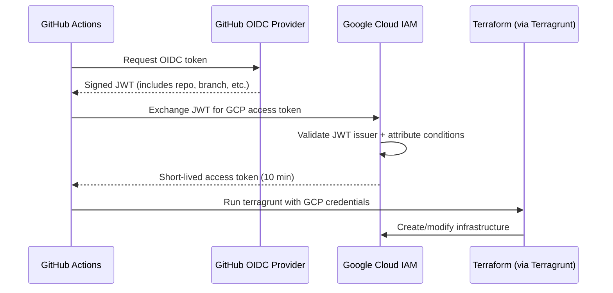

# Workload Identity Federation (WIF)

WIF lets GitHub Actions authenticate to GCP without service account keys.
GitHub proves its identity via OIDC, GCP trusts it. No secrets to rotate,
no keys to leak.

References:

- [Google: WIF with deployment pipelines](https://cloud.google.com/iam/docs/workload-identity-federation-with-deployment-pipelines)
- [google-github-actions/auth](https://github.com/google-github-actions/auth)
- [GitHub: OIDC with cloud providers](https://docs.github.com/en/actions/security-for-github-actions/security-hardening-your-deployments/configuring-openid-connect-in-cloud-providers)

## How It Works



## GitHub Secrets

Two secrets connect GitHub Actions to GCP:

| Secret | What it does |
|--------|-------------|
| `GCP_WORKLOAD_IDENTITY_PROVIDER` | The WIF provider address. Tells GitHub "exchange your OIDC token here" |
| `GCP_SERVICE_ACCOUNT` | The SA email. Tells GitHub "act as this identity once authenticated" |

These are set once via `gh secret set` — see [Bootstrap](BOOTSTRAP.md) for values.

## Managed by Terraform

WIF is not a manual setup — it's managed as code via `modules/wif-github`
and deployed through the stack like everything else. This follows the
[cloud-foundation-fabric](https://github.com/GoogleCloudPlatform/cloud-foundation-fabric)
pattern where WIF lives in the IaC admin project.

## What Gets Created

All WIF resources live in the bootstrap project (`ops-admin-7x2`):

| Resource | Name | Purpose |
|----------|------|---------|
| Workload Identity Pool | `github` | Container for external identities |
| OIDC Provider | `foundation` | Trusts GitHub's OIDC issuer |
| Service Account | `sa-ops-github-deploy` | The identity Terraform runs as |

## SA Permissions

### On the bootstrap project (ops-admin-7x2)

Granted by `modules/wif-github` automatically:

| Role | Why |
|------|-----|
| `roles/billing.projectManager` | Link billing to new projects |
| `roles/iam.serviceAccountAdmin` | Create service accounts |
| `roles/iam.workloadIdentityPoolAdmin` | Manage the WIF pool/provider |
| `roles/resourcemanager.projectIamAdmin` | Set IAM on projects |
| `roles/serviceusage.serviceUsageAdmin` | Enable/disable APIs |
| `roles/storage.admin` | Read/write Terraform state in GCS |

### On each environment project (e.g., ops-dev-7x2)

Each project grants the SA access via `iam_additive` in the stack config
(org-level bindings can be added later to reduce per-project grants):

| Role | Why |
|------|-----|
| `roles/browser` | Read project metadata (Terraform refresh) |
| `roles/serviceusage.serviceUsageAdmin` | Enable/disable APIs |
| `roles/iam.serviceAccountAdmin` | Create/manage service accounts |
| `roles/storage.admin` | Create/manage GCS buckets |
| `roles/resourcemanager.projectIamAdmin` | Set IAM bindings |

This is declared in `live/terragrunt.stack.hcl` on each project unit:

```hcl
iam_additive = {
  "roles/browser"                          = ["serviceAccount:sa-ops-github-deploy@ops-admin-7x2.iam.gserviceaccount.com"]
  "roles/serviceusage.serviceUsageAdmin"   = ["serviceAccount:sa-ops-github-deploy@ops-admin-7x2.iam.gserviceaccount.com"]
  "roles/iam.serviceAccountAdmin"          = ["serviceAccount:sa-ops-github-deploy@ops-admin-7x2.iam.gserviceaccount.com"]
  "roles/storage.admin"                    = ["serviceAccount:sa-ops-github-deploy@ops-admin-7x2.iam.gserviceaccount.com"]
  "roles/resourcemanager.projectIamAdmin"  = ["serviceAccount:sa-ops-github-deploy@ops-admin-7x2.iam.gserviceaccount.com"]
}
```

**With a GCP Org**, these would be granted once at org level and apply
everywhere. Without an org, we bake them into each project. The Terraform
code handles it — no manual `gcloud` commands needed.

## First-Time Bootstrap

The first apply must be run locally with your own gcloud credentials,
since WIF doesn't exist yet:

```bash
gcloud auth application-default login
cd live
terragrunt stack run -- apply
```

This creates the WIF resources. After that, GitHub Actions authenticates
via WIF automatically.

## Security

- **No keys** — short-lived tokens (10 min), no long-lived credentials
- **Attribute conditions** — only repos owned by `Chopsticks13` can authenticate
- **Least privilege** — SA only has the specific roles it needs per project
- **Audit trail** — all authentication events in Cloud Audit Logs
- **Infrastructure as code** — WIF config is version controlled and reviewable
